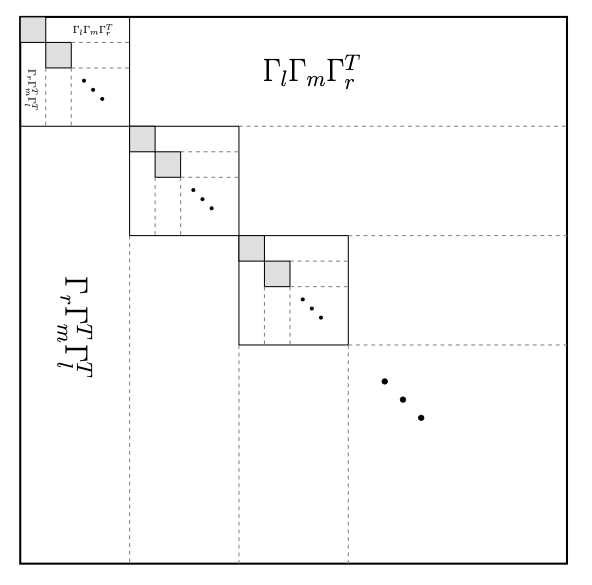
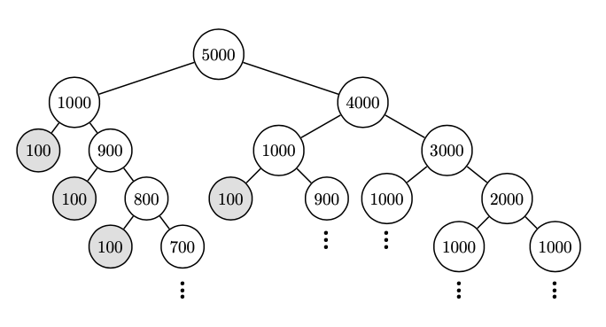

# GP-HMAT-MATLAB
Scalable GP regression with Hierarchical Matrices

## Table of contents
* [General info](#general-info)
* [Technical Ingredients](#ingredients)
* [File Contents](#contents)

## General info
This paper will be on arXiv (https://arxiv.org/abs/00000).
## Ingredients
The approach consists of two main ingredients: 1) Hierarchical decomposition of a large matrix which requires aggregation of degrees of freedom in different levels of Hierarchy. This is achieved via an algebraic multigrid technique. 2) Low rank approximation of large off-diagoanl blocks which is achieved via a randomized SVD approach with interpolative decomsposition. 

The method empirically exhibits O(nlog(n)) scalability which supports the cost estimates obtained analytically. 

  

 
## Contents
Files will be provided.

______________________
## Contact
For more information please contact via vkeshava@sci.utah.edu
